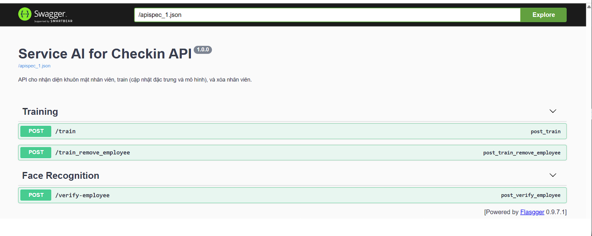
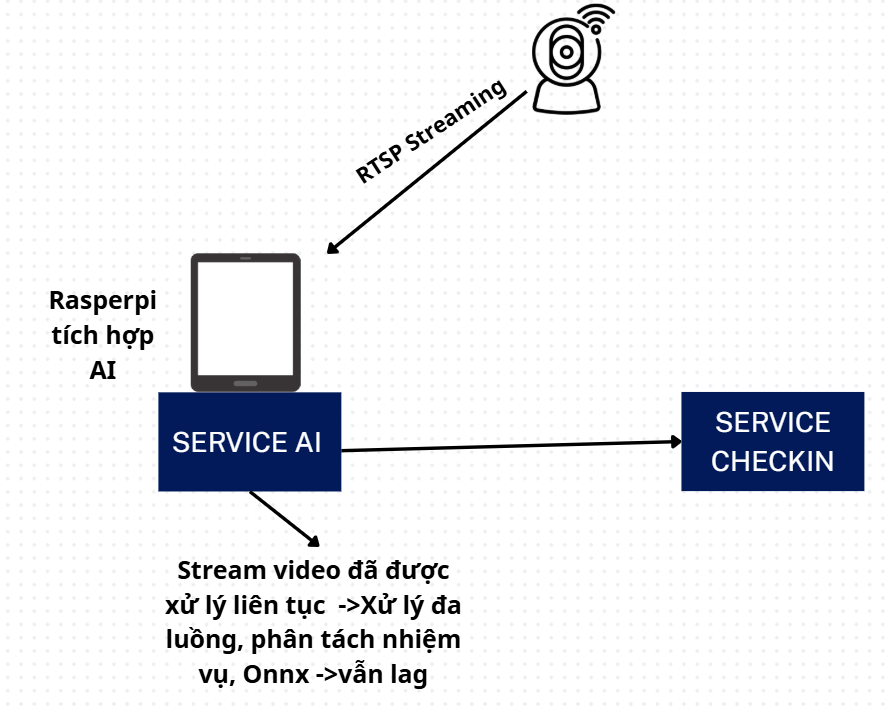
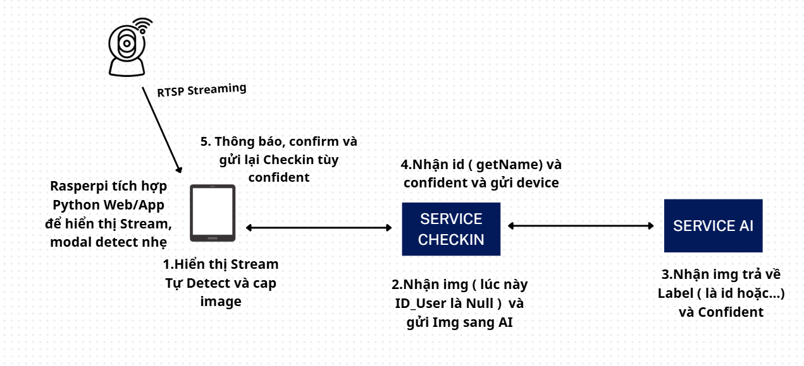
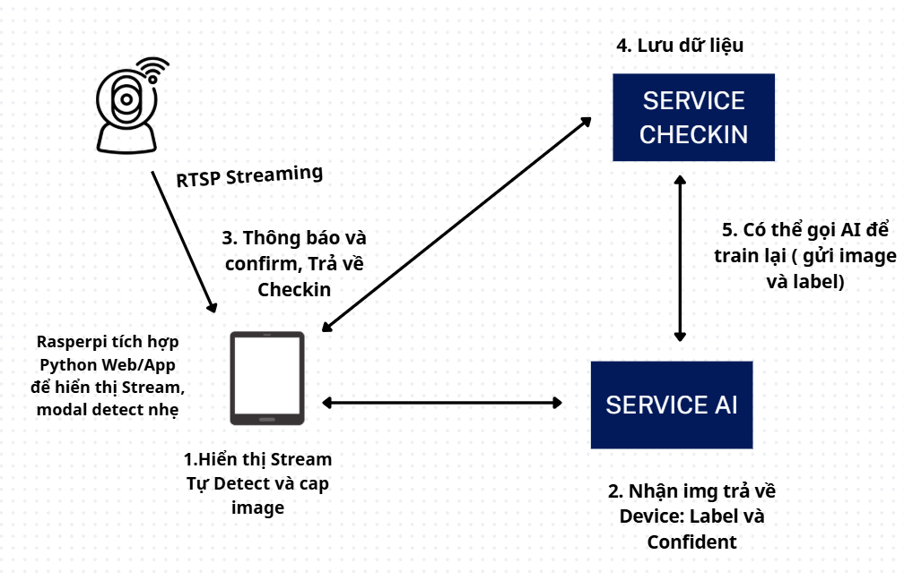

# 👁️ Backend AI Service - Incremental Face Recognition System

[](https://github.com/Do-Khai/Increamental-Face-Attendance-System)

A high-performance, real-time Face Recognition backend built with **YOLOv8** (Face Detection), **ArcFace** (Feature Extraction), and an **MLP Classifier** (Incremental Learning & Recognition). The system supports dynamic, incremental updates to learn new human faces instantly without requiring a full dataset retrain.

## 🚀 Features
- **Real-Time Detection & Recognition**: Utilizes ONNX runtime for blazing-fast inference.
- **Incremental API**: Add or remove employee faces on the fly via HTTP; the model mathematically updates and gracefully reloads.
- **Multithreaded Pipeline**: Decouples the camera stream (I/O) from the heavy AI processing (CPU/GPU) using thread-safe queues to maintain stable reading framerates.
- **Swagger Documentation**: Automated, fully interactive API documentation baked in via Flasgger.

---

## 🛠️ Environment Requirements

- **Python**: 3.10+
- **Key Dependencies**:
  - `torch`, `torchvision`, `onnxruntime`
  - `ultralytics` (YOLOv8)
  - `opencv-python`, `Pillow`, `numpy`, `pandas`, `scikit-learn`
  - `flask`, `flasgger`
  
**Installation Command:**
```bash
pip install -r requirements.txt
```

---

## 💻 Getting Started

### 0. Clone the Repository
Clone the project to your local machine:
```bash
git clone https://github.com/Do-Khai/Increamental-Face-Attendance-System.git
cd Increamental-Face-Attendance-System
```

### 1. Run the Backend API Server
Start the Flask application that handles the verification and training endpoints:
```bash
python src/app.py
```
> **📚 Swagger UI**: Once the server is running, you can access the interactive API docs at `http://localhost:5000/apidocs`.
> 
> 

### 2. Deploy via Docker
To quickly spin up the environment within a containerized volume using Docker Compose:
```bash
# Build the Docker image
docker-compose build

# Run the container in detached mode
docker-compose up -d
```

---

## 🧪 Validating Locally

### Real-Time Face Recognition Streams
You can test the real-time classification pipeline natively on your webcam or IP camera.

- **Standard ONNX Evaluation**:
  ```bash
  python src/recognizer_onnx.py
  ```
- **Optimized Multiprocessing Evaluation**:
  ```bash
  python src/recognizer_multi.py
  ```

### Manual Incremental Training
If you prefer to train new faces directly via the terminal (instead of pushing them via the API):
1. Place the new face images into `dataset/<employee_id>/`.
2. **Extract Features**: Processes the images and generates ArcFace embeddings:
   ```bash
   python src/extractor.py
   ```
3. **Train & Export Model**: Incrementally retrains the classifier and instantly builds the new `.onnx` graph:
   ```bash
   python src/trainer.py
   ```

---

## ⚙️ Configuration Setup

### Camera Data Source
To process your company's IP camera instead of your local webcam, open either `src/recognizer_onnx.py` or `src/recognizer_multi.py` and modify the Capture instance:
```python
# Replace 0 with your RTSP URL or static video feed
cv2.VideoCapture("rtsp://admin:password@[IP_ADDRESS]/stream1")
```

### Decoupled Hardware Architecture
To avoid video stuttering and dropping camera connections, the stream reading logic and the AI loop are physically decoupled:
- **Thread 1**: Dedicated completely to reading images.
- **Thread 2**: Processes the AI pipeline (**YOLO ➝ ArcFace ➝ MLP Classifier**).

By utilizing `queue.Queue(maxsize=5)`, we drop overflow buffer frames during bottlenecks. This prioritizes streaming stability over evaluating 100% of the frames.

---

## 🏗️ System Architecture Design

1. **Current Realtime Streaming Pipeline**  
   

2. **Legacy Company Infrastructure**  
   

3. **Proposed Target Architecture**  
   